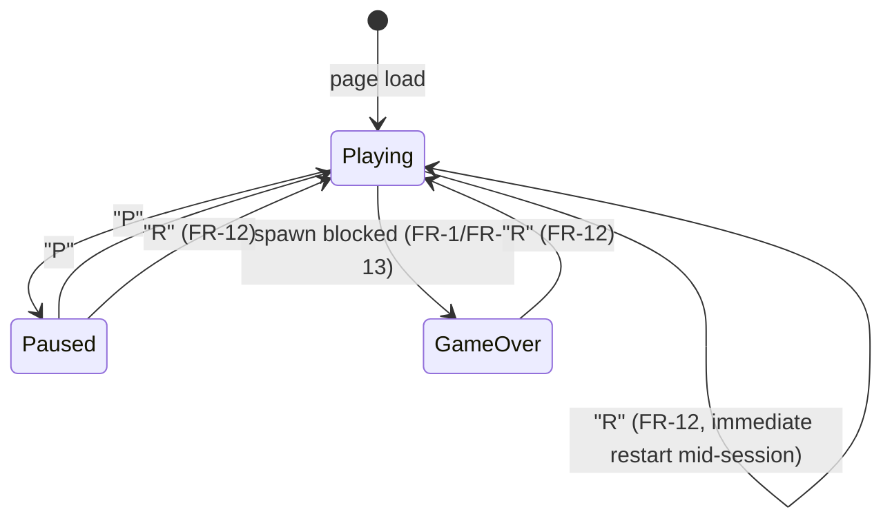
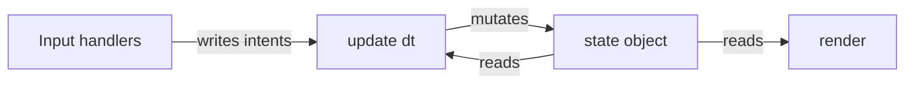

# Architecture Spine — Browser Tetris

## Design Paradigm

**Game Loop + Finite State Machine.** One mutable `state` object holds the board, the active piece, the next-piece queue, score, level, `linesCleared` (cumulative), and the current FSM state. A single `update(dt)` advances everything each tick; a single `render()` draws the current `state` to `<canvas>`. The FSM has exactly three states — `Playing`, `Paused`, `GameOver`. These map directly to three of `EXPERIENCE.md`'s five State Patterns rows; the other two (Soft Drop, Line Clear) are sub-behaviors within `Playing`, not separate FSM states.



## Invariants & Rules

### AD-1 — Single mutator, read-only elsewhere

- **Binds:** all epics
- **Prevents:** hidden or competing mutation paths across Core Gameplay, Scoring, and Session Control
- **Rule:** `update(dt)` is the only function that writes to `state`. Scoring, line-clear, and level-up all happen inline within the same `update` pass — no event bus, no pub-sub. `render()` and the keydown handlers only read `state`.

### AD-2 — Loop timing: rAF + delta accumulator

- **Binds:** Core Gameplay Loop, Session Control
- **Prevents:** frame-rate-dependent fall speed and move-repeat; inconsistent pause semantics
- **Rule:** the loop runs on `requestAnimationFrame`, accumulating elapsed delta-time to drive all fixed-rate game logic — piece fall, soft-drop rate, and horizontal move-repeat (FR-2) alike; none of these use the browser's native keyboard-repeat event. Entering `Paused` stops the accumulator itself, not just the render call — no game-time may elapse while paused. On `Paused` → `Playing`, the accumulator's reference timestamp resets to the resume instant, so neither a stale elapsed-time value nor a real-world time-spike carries across the pause boundary.

### AD-3 — Board representation

- **Binds:** Core Gameplay Loop, Session Control (Restart), render
- **Prevents:** divergent grid indexing between spawn, collision, render, and restart
- **Rule:** `state.board` is a row-major 2D array, `board[row][col]`, 20 rows x 10 cols. Row 0 is the top of the board; row indices increase downward, so a settling piece moves toward higher row indices. Each cell is `null` (empty) or a piece-color key (`I`, `O`, `T`, `S`, `Z`, `J`, `L`).

### AD-4 — Shared piece-shape table

- **Binds:** Core Gameplay Loop (spawn, rotate, lock, render)
- **Prevents:** visual/collision mismatch from re-derived shape data
- **Rule:** one constant lookup table, `PIECE_SHAPES`, covering all 7 piece types x 4 rotation states x their occupied-cell offsets. Spawn, the rotation collision-check (PRD FR-3 — reject-on-collision, no wall-kick), and render all read this same table. No rotation offsets are computed or duplicated elsewhere.

### AD-5 — Next-piece queue interface

- **Binds:** Core Gameplay Loop (FR-1, spawn), Session Control (FR-10, preview render)
- **Prevents:** the preview ever showing a piece other than the one that actually spawns next
- **Rule:** `state.nextQueue` is an array, length >= 1. Spawn logic (write) dequeues from the front and refills the tail. The preview renderer only peeks index 0 — it never mutates the queue. The randomization algorithm that refills it is intentionally unfixed here (see Deferred).

### AD-6 — Script organization

- **Binds:** all epics
- **Prevents:** ad hoc multi-file or multi-module structure that the single-file/no-build constraint can't support
- **Rule:** one inline `<script>` in the single HTML file, IIFE-wrapped, with clearly separated internal sections: state, input, update, render, main. No `<script type="module">`, no external `.js` files.



### AD-7 — Input intent handoff

- **Binds:** all epics
- **Prevents:** ad hoc, mutually incompatible mechanisms for turning key events into state changes (e.g. Core Gameplay's repeat logic conflicting with Session Control's single-press semantics)
- **Rule:** keydown/keyup handlers only set or clear fields on a single `input` object — never touch `state` directly. Held-style intents (`input.left`, `input.right`, `input.down`) are booleans toggled on keydown/keyup. Edge-triggered intents (`input.rotate`, `input.hardDrop`, `input.pause`, `input.restart`) are one-shot flags set on keydown and cleared by `update()` once consumed. `update()` is the only reader of `input` (consistent with AD-1's single-mutator rule).

### AD-8 — Restart resets full session state

- **Binds:** Session Control (FR-12), Core Gameplay Loop, Scoring & Progression
- **Prevents:** a compliant Restart that clears the board but leaves a stale active piece, next-piece queue, or counters behind
- **Rule:** Restart (FR-12) replaces, within one `update()` pass: `state.board` (AD-3, all `null`), `state.activePiece` (freshly spawned per AD-4), `state.nextQueue` (freshly (re)generated per AD-5), `state.score`, `state.level`, and `state.linesCleared` — all together, reset to their initial values. No field survives from the prior session.

### AD-9 — Line-clear flash is a render-layer echo, not a delayed mutation

- **Binds:** Core Gameplay Loop (FR-7), render
- **Prevents:** two AD-1-compliant implementations disagreeing on whether the clear-and-shift happens instantly or is held open across several ticks
- **Rule:** line clear (FR-7) mutates `state.board` synchronously, within the same `update()` pass that detected it — cleared rows are removed and rows above shift down immediately, satisfying AD-1's single-mutator rule. The visual flash is a separate render-layer echo: `update()` additionally writes the pre-clear row colors and a short frame-count into `state.flashRows`, which `render()` draws on top for its remaining frame count while `update()` decrements it each tick. The flash never delays or blocks the underlying board mutation.

## Consistency Conventions

| Concern | Convention |
| --- | --- |
| Naming (entities, files, interfaces, events) | Piece-color keys and state names use the PRD Glossary terms verbatim (`Board`, `Line Clear`, `Next-Piece Preview`, `Level`, `Game Over`). JS identifiers: `camelCase` for variables/functions, `UPPER_SNAKE_CASE` for constant tables (`PIECE_SHAPES`, `SCORE_TABLE`). |
| Data & formats (ids, dates, error shapes, envelopes) | No IDs, dates, or network envelopes — nothing here crosses a serialization boundary. Piece-color keys (`I`/`O`/`T`/`S`/`Z`/`J`/`L`) are the one shared enum, defined once in `PIECE_SHAPES`. |
| State & cross-cutting (mutation, errors, logging, config, auth) | Single mutator (AD-1). No auth, no persistence, no network — none apply. Errors: none expected to be thrown in normal play; an uncaught exception is itself a Definition-of-Done failure per the PRD (console must stay clean). |

## Stack

| Name | Version |
| --- | --- |
| JavaScript | ES2020+ (native browser support, no transpilation) |
| Rendering | Canvas 2D API (native browser, no library) |
| Dependencies | none — zero-dependency per PRD Cross-Cutting NFRs |

## Structural Seed

```text
tetris.html          # everything: <style>, <canvas>, <script> — single file
  <style>             # DESIGN.md tokens as CSS custom properties
  <canvas id="board">
  <div id="hud">      # score / level / lines / next-piece preview (DOM, not canvas)
  <div id="overlay">  # Pause / Game-Over overlays — DOM, absolutely positioned over
                       # the canvas, same treatment as #hud; not canvas-drawn
  <script>            # IIFE: state -> input -> update -> render -> main
```

Deployment/operational envelope: none by design. A single static HTML file, opened directly via `file://`. No server, no build step, no CI/CD, no environments to configure — stated explicitly rather than left silent, per the PRD's zero-dependency/offline constraint.

## Capability → Architecture Map

| Capability / Area | Lives in | Governed by |
| --- | --- | --- |
| Core Gameplay Loop (FR-1..FR-7) | `update()` state/input sections | AD-1, AD-2, AD-3, AD-4, AD-7, AD-9 |
| Scoring & Progression (FR-8, FR-9) | `update()`, inline with line-clear handling | AD-1, AD-9 |
| Session Control (FR-10..FR-13) | `update()` (pause/restart/game-over transitions), `render()` (HUD, preview, overlays) | AD-1, AD-2, AD-5, AD-7, AD-8 |

## Deferred

- **Next-piece randomization algorithm** (7-bag vs. uniform-random vs. other) — the queue *interface* is fixed (AD-5); the algorithm only affects the spawn logic that fills it, no other epic depends on which one is chosen. Revisit if a story needs it decided; PRD is silent on this.
- **Exact fall-speed curve per level** — PRD FR-9 explicitly leaves this as an implementation detail with no target; no cross-epic dependency on the specific numbers, so nothing to fix here either.
- **Line-clear flash exact duration** — AD-9 fixes the mechanism (render-layer echo via `state.flashRows`, decoupled from the synchronous mutation); the specific frame-count it holds for is not pinned, since no other epic depends on the exact number.
